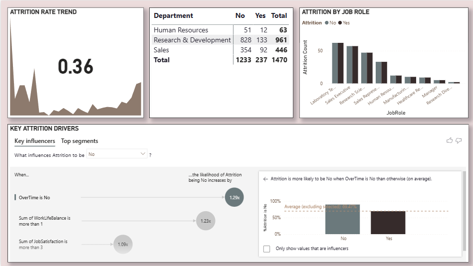
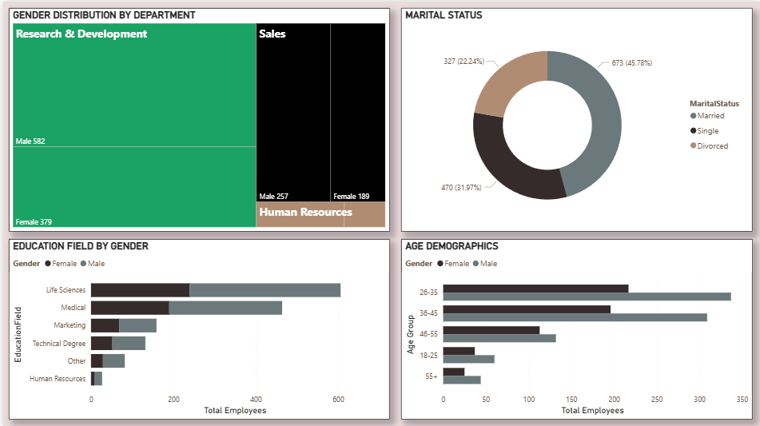
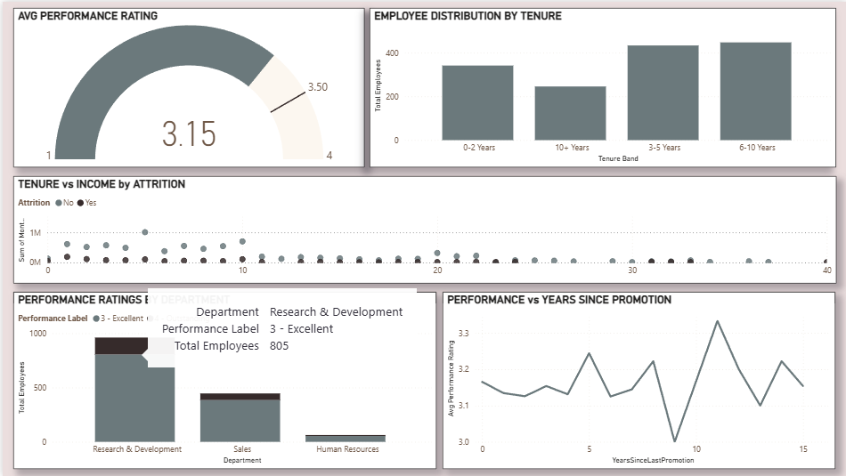
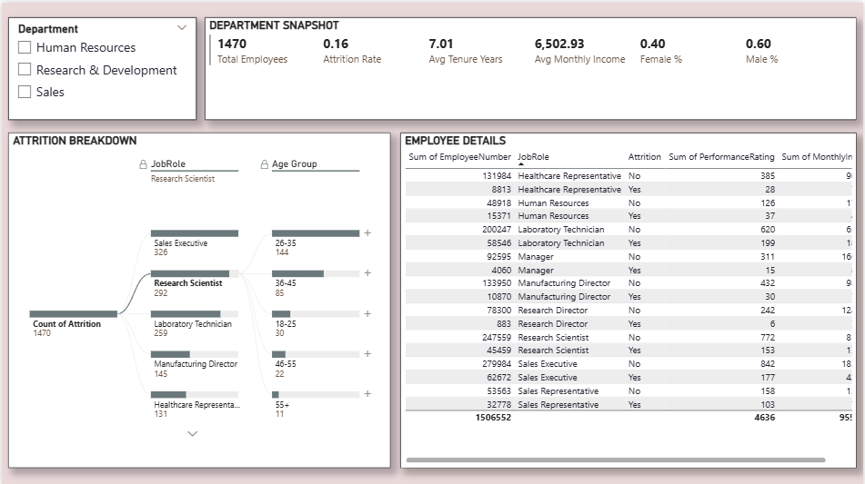

# 🏦 Executive HR Dashboard | Power BI


## 📌 Project Overview

This **executive-level HR dashboard** analyzes workforce data to provide strategic insights for leadership decision-making. Built with a "bank style" professional aesthetic, this dashboard transforms raw HR data into actionable business intelligence.

**Dataset**: IBM HR Analytics Employee Attrition & Performance (1,470 employees, 35 attributes)  
**Tools Used**: Power BI Desktop, Power Query, DAX  
**Timeline**: Complete end-to-end analysis in under 10 hours

### 🎯 Business Questions Answered
- What is our current headcount and attrition rate?
- Which departments have the highest turnover and why?
- How diverse is our workforce across gender, age, and education?
- Is there a relationship between performance, tenure, and compensation?
- What actionable steps can leadership take to improve retention?

---

## 📊 Live Dashboard Preview

### Executive Overview
> High-level KPIs: Headcount, Attrition Rate, Average Tenure, Average Salary


### Attrition Deep-Dive
> Analyzing turnover by department, job role, and key drivers



### Diversity & Inclusion Metrics
> Gender distribution, age demographics, and education field breakdown



### Performance & Tenure Analysis
> Performance ratings distribution, tenure bands, and compensation correlation



### Department-Level Drill-Down
> Interactive view of any department's KPIs and employee composition



---

## 🔧 Key Metrics & DAX Measures

### Core Calculations
```dax
// Total Active Employees
Active Employees = CALCULATE(
    COUNTROWS('HR Data'),
    'HR Data'[Attrition] = "No"
)

// Attrition Rate
Attrition Rate = DIVIDE(
    CALCULATE(COUNTROWS('HR Data'), 'HR Data'[Attrition] = "Yes"),
    COUNTROWS('HR Data'),
    0
)

// Average Tenure (Years)
Avg Tenure Years = AVERAGE('HR Data'[YearsAtCompany])

// Female Percentage
Female % = DIVIDE(
    CALCULATE(COUNTROWS('HR Data'), 'HR Data'[Gender] = "Female"),
    COUNTROWS('HR Data'),
    0
)
```

[Full DAX Measures Library](docs/DAX_measures.txt)

---

## 💡 Key Business Recommendations

### 1. 🎯 Reduce Sales Department Attrition
**Finding**: Sales department shows **20% attrition rate** vs. company average of 16%. Sales Representatives have the highest turnover.  
**Impact**: Estimated replacement cost of **$10,000-15,000 per sales role**.  
**Recommendation**: Implement quarterly retention bonuses for Sales Reps with >2 years tenure. Conduct dedicated Sales exit interviews.  
**Priority**: HIGH

### 2. 📉 Address Early-Career Turnover
**Finding**: Employees aged 18-25 have **35% higher attrition** than other groups. Female employees under 25 show **50% attrition rate**.  
**Impact**: Loss of entry-level talent pipeline and recruitment ROI.  
**Recommendation**: Launch "Early Career Mentorship Program" pairing junior employees with senior leaders.  
**Priority**: HIGH

### 3. ⚖️ Improve Work-Life Balance
**Finding**: Employees with low work-life balance scores have **2.2x higher attrition**. Overtime employees show **30% higher turnover**.  
**Impact**: Burnout-driven turnover affecting productivity and culture.  
**Recommendation**: Audit department overtime policies. Implement "No Meeting Fridays" in highest overtime departments.  
**Priority**: MEDIUM

### 4. 🚀 Align Promotions with Performance
**Finding**: **40% of high performers** haven't received promotions in 5+ years. These employees show **25% higher attrition risk**.  
**Impact**: Losing top talent due to career stagnation.  
**Recommendation**: Create "High Performer Fast Track" program guaranteeing promotion review within 24 months.  
**Priority**: MEDIUM

### 5. 🌍 Address Department Gender Imbalance
**Finding**: R&D is **85% male**; Human Resources is **65% male**.  
**Impact**: Diversity gaps in innovation teams; potential brand reputation risk.  
**Recommendation**: Set hiring targets for underrepresented genders. Partner with diversity-focused recruitment organizations.  
**Priority**: STRATEGIC

[Complete Recommendations Document](docs/business_recommendations.md)

---

## 🛠️ Tools & Technologies

| Tool | Purpose |
|------|---------|
| **Power BI Desktop** | Data modeling, DAX calculations, visualization |
| **Power Query** | Data cleaning and transformation |
| **DAX** | Created 20+ custom measures for KPIs |
| **GitHub** | Version control and project hosting |

---

## 📁 Repository Structure

```
HR-Executive-Dashboard/
│
├── README.md                          # You are here
├── LICENSE                            # MIT License
│
├── data/
│   └── WA_Fn-UseC_-HR-Employee-Attrition.csv    # Original dataset
│
├── dashboard/
│   └── HR_Executive_Dashboard.pbix               # Power BI file
│
├── screenshots/                        # All dashboard images
│   ├── 01_executive_overview.png
│   ├── 02_attrition_analysis.png
│   ├── 03_diversity_metrics.png
│   ├── 04_performance_tenure.png
│   └── 05_department_drilldown.png
│
├── docs/
│   ├── DAX_measures.txt                # All DAX formulas
│   └── business_recommendations.md     # Detailed recommendations
│
└── references/
    └── helpful_links.txt                # Resources used
```

---

## 🚀 How to Use This Project

### Option 1: View the Dashboard
1. Browse the screenshots folder to see the final output
2. Read the business recommendations section for insights

### Option 2: Explore Interactive Version
1. Download `dashboard/HR_Executive_Dashboard.pbix`
2. Open with Power BI Desktop (free)
3. Interact with slicers and explore the data yourself

### Option 3: Reproduce the Analysis
1. Download the dataset from [Kaggle](https://www.kaggle.com/datasets/pavansubhasht/ibm-hr-analytics-attrition-dataset)
2. Follow the step-by-step guide in the documentation
3. Use the DAX measures provided in `docs/DAX_measures.txt`

---

## 📈 Key Insights Summary

- **Overall Attrition Rate**: 16.2% (above industry average)
- **Highest Attrition Department**: Sales (20.6%)
- **Lowest Attrition Department**: Research & Development (13.8%)
- **Average Employee Tenure**: 7.0 years
- **Gender Distribution**: 60% Male, 40% Female
- **Average Monthly Income**: $6,500
- **High Performers (>3 rating)**: 15% of workforce

---

## 👨‍💻 About Me

**[Your Name]**
Data Analyst specializing in HR analytics and executive dashboards

- **Portfolio**: [yourwebsite.com]
- **LinkedIn**: [linkedin.com/in/yourprofile]
- **Email**: youremail@domain.com

I create data solutions that help leadership teams make better decisions. This project demonstrates my ability to:
- Transform raw data into strategic insights
- Design professional, executive-level dashboards
- Communicate complex findings through storytelling
- Operate within organizational contexts and constraints

---

## 📄 License

This project is open source under the MIT License - see the [LICENSE](LICENSE) file for details.

## 🙏 Acknowledgments

- IBM for creating the fictional HR dataset
- Kaggle for hosting the data
- Power BI community for DAX inspiration
```
